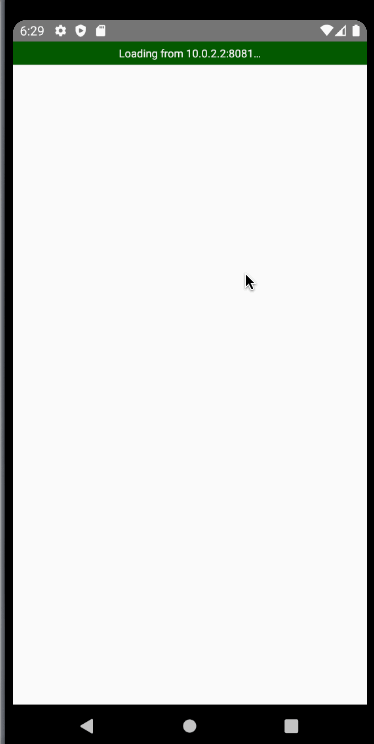

# Transactions Demo

This application creates a transactions list with different types of accounting capability and organizes it in chronological order indepedentent of how the data is received. The data is pre-defined for simplicity, but could easily be expanded upon to include user input of transactions.

This project has fully tested models and actions with snapshots for visual regressions. It was built in a couple days as a demonstration.

## Quick Look



## A Project for Exploring Skills

Using the base of Ignite, a stack I'm familiar with from previous work, I built this project with technologies that I would use in a production application.

What it doesn't do:

- Explore the usage of APIs as the data is embedded

Currently includes:

- React Native
- React Navigation
- MobX State Tree
- TypeScript
- And more!

## Why Ignite

Beyond familiarity with the stack, Ignite provides a basis of helpers that allow for rapid prototyping with robustness. For example:

- Storybook to explore components as I build them.
- Pre-configured with powerful debugging tools such as Reactotron/Flipper.
- Core reusable components readily available (eg, Screen).
- Code generators to rapidly scaffold new elements of the app.

Along with the support of the React community.

## Further Considerations / Code Review

- test mocking probably didn't need to be separated if they're simply one line. Migrate once they grow larger, otherwise feels like bloat.
- create `useAnimatedValue` hook that abstracts the common pattern used to create the `ref`
  - intention: to ensure consistency of the pattern and reduce duplicated Code
- fix the random delay as it feels off
  - potential solution: add month section headers in the `FlatList` and load in by months to create a stagger effect
- take better advantage of optional chaining to reduce the verbosity of code, example:

```typescript
// verbose
const hasDetails = transaction.details && transaction.details.length > 0
// concise
const hasDetails = transaction?.details?.length > 0
```

- clean up the type-safety to improve knowing when a value is optional vs required, then add appropriate guards and/or view states to account for the edge cases.
- migrate to use `StyleSheet.create` pattern to reduce the style management complexity with `ramda`; this also improves style typesafety and intellisense in `VSCode` for a better DX (dev experience)
- destructure props in function component signature; in most cases this leads to clearer function bodies and less code (see `user-header.tsx` for example)
- fix MST store type-safety, a few default to `any`
  - strategy: enable strict-mode in linter (not allowing `any` type) and resolve errors
- update the project so it can run properly in newer environments. It currently fails to compile on newer versions of iOS and Node.
- enforce using `import type` patterns with lint-rules to safeguard against edge-case problems and improved optimizations
  - see example of usage in `transaction-store.ts`
  - see a decent write-up/summary of benefits on [stackoverflow](https://stackoverflow.com/questions/61412000/do-i-need-to-use-the-import-type-feature-of-typescript-3-8-if-all-of-my-import) with reference to documentation
- migrate away from `index.ts` export modules for root folders as it can lead to import require cycles.
  - potential strategy: employ absolute path import aliases to reduce messy nesting and improve readability (see example from [nextjs docs](https://nextjs.org/docs/advanced-features/module-path-aliases))
  - alternative strategy: move common imports into private modules that are managed with your package manager
- in most cases, `async` `await` statements could be within a `try/catch` block avoiding less readable promise-chaining
- avoid single character variable names where it may cause confusion (see `transaction-store.ts`)
- strongly define types for view state that has ambiguous types based upon the inital value to avoid confusion and potential issues should the typing break in the model, example from `transactions-screen.tsx`:

```typescript
const [data, setData] = useState<Transaction[]>([])
const [currentUser, setCurrentUser] = useState<User | null>(null)
```

## Quick Start

The project's structure looks similar to this:

```
Transactions Demo
├── app
│   ├── components
│   ├── i18n
│   ├── utils
│   ├── models
│   ├── navigation
│   ├── screens
│   ├── services
│   ├── theme
│   ├── app.tsx
├── storybook
│   ├── views
│   ├── index.ts
│   ├── storybook-registry.ts
│   ├── storybook.ts
├── test
│   ├── __snapshots__
│   ├── storyshots.test.ts.snap
│   ├── mock-i18n.ts
│   ├── mock-reactotron.ts
│   ├── setup.ts
│   ├── storyshots.test.ts
├── README.md
├── android
│   ├── app
│   ├── build.gradle
│   ├── gradle
│   ├── gradle.properties
│   ├── gradlew
│   ├── gradlew.bat
│   ├── keystores
│   └── settings.gradle
├── ignite
│   ├── ignite.json
│   └── plugins
├── index.js
├── ios
│   ├── IgniteProject
│   ├── IgniteProject-tvOS
│   ├── IgniteProject-tvOSTests
│   ├── IgniteProject.xcodeproj
│   └── IgniteProjectTests
├── .env
└── package.json

```

### ./app directory

Included in an Ignite boilerplate project is the `app` directory. This is a directory you would normally have to create when using vanilla React Native.

The inside of the src directory looks similar to the following:

```
app
│── components
│── i18n
├── models
├── navigation
├── screens
├── services
├── theme
├── utils
└── app.tsx
```

**components**
This is where the React components will live. Each component will have a directory containing the `.tsx` file, along with a story file, and optionally `.presets`, and `.props` files for larger components. The app will come with some commonly used components like Button.

**i18n**
This is where the translations will live if you are using `react-native-i18n`.

**models**
This is where the app's models will live. Each model has a directory which will contain the `mobx-state-tree` model file, test file, and any other supporting files like actions, types, etc.

**navigation**
This is where the `react-navigation` navigators will live.

**screens**
This is where the screen components will live. A screen is a React component which will take up the entire screen and be part of the navigation hierarchy. Each screen will have a directory containing the `.tsx` file, along with any assets or other helper files.

**services**
Any services that interface with the outside world will live here (think REST APIs, Push Notifications, etc.).

**theme**
Here lives the theme for your application, including spacing, colors, and typography.

**utils**
This is a great place to put miscellaneous helpers and utilities. Things like date helpers, formatters, etc. are often found here. However, it should only be used for things that are truely shared across your application. If a helper or utility is only used by a specific component or model, consider co-locating your helper with that component or model.

**app.tsx** This is the entry point to your app. This is where you will find the main App component which renders the rest of the application. This is also where you will specify whether you want to run the app in storybook mode.

### ./ignite directory

The `ignite` directory stores all things Ignite, including CLI and boilerplate items. Here you will find generators, plugins and examples to help you get started with React Native.

### ./storybook directory

This is where the stories will be registered and where the Storybook configs will live

### ./test directory

This directory will hold your Jest configs and mocks, as well as your [storyshots](https://github.com/storybooks/storybook/tree/master/addons/storyshots) test file. This is a file that contains the snapshots of all your component storybooks.

## Running Storybook

From the command line in your generated app's root directory, enter `yarn run storybook`
This starts up the storybook server.

In `app/app.tsx`, change `SHOW_STORYBOOK` to `true` and reload the app.

For Visual Studio Code users, there is a handy extension that makes it easy to load Storybook use cases into a running emulator via tapping on items in the editor sidebar. Install the `React Native Storybook` extension by `Orta`, hit `cmd + shift + P` and select "Reconnect Storybook to VSCode". Expand the STORYBOOK section in the sidebar to see all use cases for components that have `.story.tsx` files in their directories.
